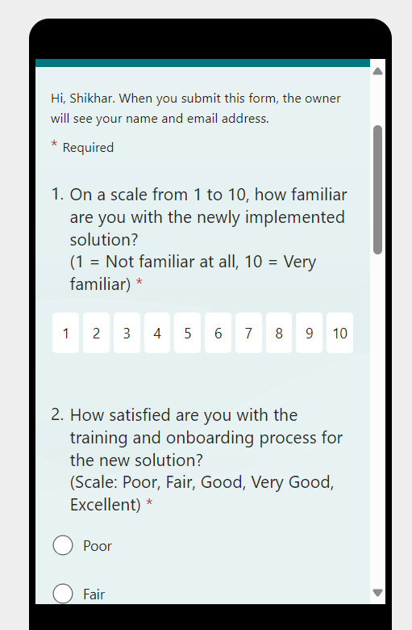
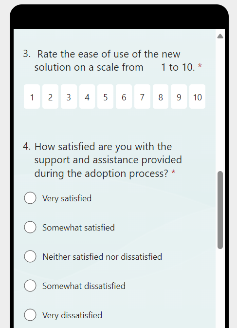

# Inventory Count Cognex Camera Vision

**My role**: PRODUCT PROJECT MANAGER \
**Skills**: Agile Methodologies, Stakeholder Management, Resource Management, Vendor Management, User Interviews, Solution Design, Prioritization, Wireframing and prototyping, User testing, Product launch, User Adoption \
**Tools Used**: Clarity, JIRA, Mural, Excel

## Problem Definition - Voice of the Customer (VOC)

Based on the users pain points, with the help from engineering team, led the product discovery phase.

## Introduction Stage
Based on discovery phase, Complete Automation Resource (CAR) introduced the vision system. At this stage, Cognex Camera was introduced to the market.
The internal team with the help from the vendor (CAR), completed through market research and development to assess the product feasibility and potential
benefits for Dakota City. A Cognex Vision System would read the box label in every location and transmit that back to the Warehouse Management System, this would then be verified against what the system says is truly there. 
If a discrepancy is found those could be easily investigated by Team Members thus reducing the cost of labor substantially. If needed a picture of each label that the proposed system takes could be achieved for future verification. 

## Growth Stage
As the vision system is implemented and starts functioning within Dakota City's Material Handling, it will likely experience a period of growth as its usage expands and becomes integrated into the operations. 
This stage was characterized by increasing product acceptance. As the product may scale in other locations, promotion of the vision system within the organization will be crucial for its adoption. This includes internal marketing efforts to educate employees about its benefits and encourage its use.

## Maturity Stage
Once the vision system becomes fully integrated into the inventory process and is widely adopted, it enters the maturity stage. During this stage, the technology reaches its peak level of adoption and market saturation. The implementation of the vision system aims to reduce labor costs and improve efficiency in the inventory process. 

## Decline Stage
Over time, advancements in technology may lead to the decline of the vision system as newer, more efficient technologies 
emerge. This would signify the decline stage of the product life cycle, where the system becomes outdated and less relevant to the
needs of the organization.  
Continuous monitoring of the vision system will be required to keep up-to-date with 
changing technical landscape.

## Highlevel Product Project Roadmap

## Wireframes & MVP

## Product Launch & Tracking Metrics
#### LAUNCH PLANNING  
I created a through launch plan that included key stakeholders, internal marketing strategy, product monitoring, adoption and risk mititation strategy. 

The following key performance metrics were monitored on an ongoing basis:  
* Data/Picture Collection:  Plant Supervisor, Warehouse Management System, Real-time basis, and Automated
* Performance Review: Plant Manager, Warehouse Management System, Bi-Weekly, and Use Report

#### PROCESS MONITORING  
* Camera has unobstructed view
* Camera wirings must not interfere with daily processes

#### USER ADOPTION SURVEY  

#### METRICS
* Optimized efficiency with an IRR of 31.5%

 
