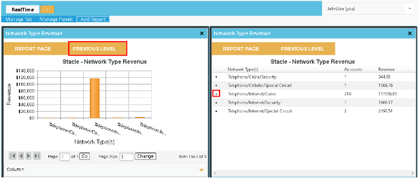
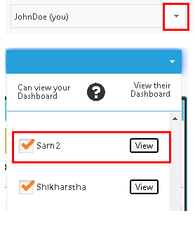
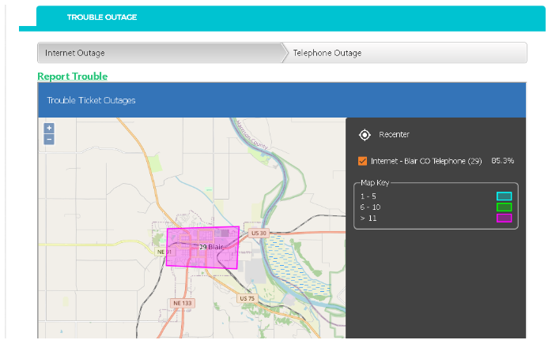
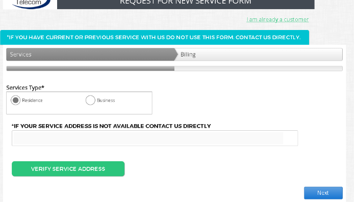

# Software-as-a-Service (SaaS) Product
 
**My role**: .NET Software Developer & Scrum Master\ 
**Skills**: Agile Methodologies, Stakeholder Management, Demo Presentation, Requirements, Stories creation, Prioritization, User testing\
**Tools Used**: .NET, MS SQL, Telerik packages, JIRA, Excel
 
## Web Reporting Product
Designed and implemented drill-down, paging, and dashboard access control requirements for real-time reports. Users were able to drill down for both grids and graph reports on the Dashboard. 
Users were able to drill up and down on the graph reports by clicking charts in the graph to drill down to deep dive into data insights.
This functions similarly to the ‘+’ button on the grid reports. To return to the previous level, users will simply need to click on the Previous Level button to drill up into the graph charts or grid.

Users were able to page through the report results and establish page size. The report footer displays paging options for users 
to page forward or backward as desired. Users will be able to select a page size to display in the view. 
The Charts display all of the data. Previously, the data point limit was only 10, now increased to 1000. 
By hovering over the report title, users can view the report parameters for the selected report.

Another feature release was the ability to view other users’ dashboards. By selecting the arrow next to a user’s login, a dropdown list will 
display other users to whom dashboard access can be granted. Selecting the View button for a specific user grants access to a dashboard and 
disabling the View button removes it for the other user. Access could be denied to other users if they do not 
have access rights to any of the reports.

## Web-Self Care Product
#### Feature 1
Users could search or select address based services. End users were empowered to view available services based on an address search 
from the Map View option. When an address is entered and the Search button is selected, a list of available services for the entered address 
appears for the user to view.

#### Feature 2
Implemented visual representation of outages via Map view.

#### Feature 3
Redesigned and implemented new user-friendly customer screen for users. This allowed users to view and select services available efficiently.

