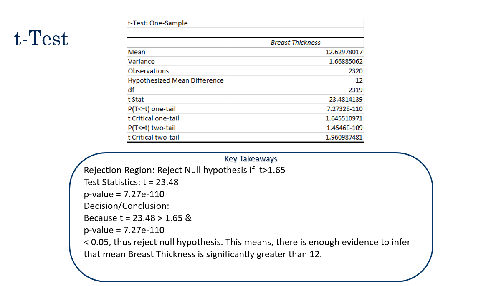

# Gocator Computer Vision

**My role**: PRODUCT PROJECT MANAGER, 
**Skills**: Agile methodologies, Stakeholder Management, User Research and Interviews, Solution Design, Prioritization, Wireframing and prototyping, User testing, Product launch, User Adoption
**Tools Used**: Clarity for Project & Resource Management, JIRA for Product roadmapping, Feature prioritization, & Requirements/User stories creation, Mural

# Phase 1 - Problem Definition
Today's process of taking sample thickness measurement is inconsistent and fraught with errors. The data from the inconsistent measurements every hour are sued to adjust the meat thickness press which leads to errors. Sometimes machine adjustment are not needed and business ends up with customer complaints as well as worst case scenario - product recall, since the meats are too thick which leads to under cooked or the meats are too thin which leads to over cooked, given the time and temperature. 

Manually, calipers are used to measure the thickness of the chicken filet. Example of a target thickness can range from 9-11mm. There is a high degree of variability that comes with measuring the filet. It is possible to end up with 10 different measurements taken by 10 different people. 

**Objective**  
Based on the users pain points, I led the product discovery phase. At first we wanted to understand the Baseline Performance, so in order to do so, the team frequently visited the production plant and interviewed multiple stakeholders to gather requirements, data and feedback. When we analyzed the initial-baseline data, we came up the following result:

Next, we also needed to validate product hypothesis. 

# Phase 2 - User & Data Research
During the user interview, we found out user experience could be enhanced as team members were manually logging in measurements data in excel sheets, a very tedious tasks for team members.   We also conducted Hypothesis Testing Analysis using baseline data to determine whether the sample mean measurement is significantly greater than 12 inch (thickness). For this, we used t-Test. 

